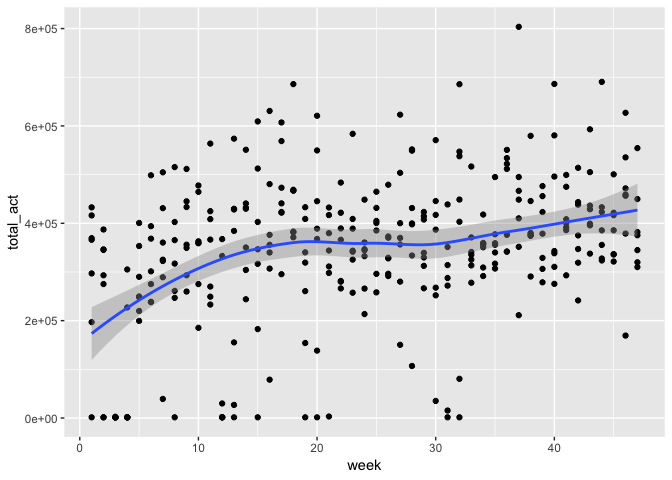

Midterm Project
================

### Setup

``` r
library(tidyverse)
library(knitr)
library(patchwork)
library(viridis)
library(wordcountaddin)
```

### Data Cleaning

``` r
accel_data = read_csv(file = "data/p8105_mtp_data.csv") %>% 
  janitor::clean_names() %>% 
  mutate(day = as.factor(day)) %>% 
  mutate(day = 
           factor(day, levels = 
                    c("Sunday", "Monday", "Tuesday", 
                      "Wednesday", "Thursday",
                      "Friday", "Saturday"), 
                  ordered = TRUE)) %>% 
  arrange(day) %>% 
  arrange(week) %>% 
  mutate(total_act = rowSums(.[,3:1440], na.rm = TRUE)) %>% 
  mutate(avg_act = rowMeans(.[,3:1440], na.rm = TRUE))

accel_data[1:10, 1:1444]
```

    ## # A tibble: 10 x 1,444
    ##     week day   activity_1 activity_2 activity_3 activity_4 activity_5
    ##    <int> <ord>      <dbl>      <dbl>      <dbl>      <dbl>      <dbl>
    ##  1     1 Sund…         1         1          1          1          1  
    ##  2     1 Mond…         1         1          1         43.0        1  
    ##  3     1 Tues…         1         1          1          1          1  
    ##  4     1 Wedn…         1       845.       213.       580.       492. 
    ##  5     1 Thur…         1         1          1          1          1  
    ##  6     1 Frid…         1        22.         1        116.        43.0
    ##  7     1 Satu…         1         1          1          1          1  
    ##  8     2 Sund…         1         1          1          1          1  
    ##  9     2 Mond…         1        43.0       11.0      425.         1  
    ## 10     2 Tues…        22.        1         11.0        1         64.0
    ## # ... with 1,437 more variables: activity_6 <dbl>, activity_7 <dbl>,
    ## #   activity_8 <dbl>, activity_9 <dbl>, activity_10 <dbl>,
    ## #   activity_11 <dbl>, activity_12 <dbl>, activity_13 <dbl>,
    ## #   activity_14 <dbl>, activity_15 <dbl>, activity_16 <dbl>,
    ## #   activity_17 <dbl>, activity_18 <dbl>, activity_19 <dbl>,
    ## #   activity_20 <dbl>, activity_21 <dbl>, activity_22 <dbl>,
    ## #   activity_23 <dbl>, activity_24 <dbl>, activity_25 <dbl>,
    ## #   activity_26 <dbl>, activity_27 <dbl>, activity_28 <dbl>,
    ## #   activity_29 <dbl>, activity_30 <dbl>, activity_31 <dbl>,
    ## #   activity_32 <dbl>, activity_33 <dbl>, activity_34 <dbl>,
    ## #   activity_35 <dbl>, activity_36 <dbl>, activity_37 <dbl>,
    ## #   activity_38 <dbl>, activity_39 <dbl>, activity_40 <dbl>,
    ## #   activity_41 <dbl>, activity_42 <dbl>, activity_43 <dbl>,
    ## #   activity_44 <dbl>, activity_45 <dbl>, activity_46 <dbl>,
    ## #   activity_47 <dbl>, activity_48 <dbl>, activity_49 <dbl>,
    ## #   activity_50 <dbl>, activity_51 <dbl>, activity_52 <dbl>,
    ## #   activity_53 <dbl>, activity_54 <dbl>, activity_55 <dbl>,
    ## #   activity_56 <dbl>, activity_57 <dbl>, activity_58 <dbl>,
    ## #   activity_59 <dbl>, activity_60 <dbl>, activity_61 <dbl>,
    ## #   activity_62 <dbl>, activity_63 <dbl>, activity_64 <dbl>,
    ## #   activity_65 <dbl>, activity_66 <dbl>, activity_67 <dbl>,
    ## #   activity_68 <dbl>, activity_69 <dbl>, activity_70 <dbl>,
    ## #   activity_71 <dbl>, activity_72 <dbl>, activity_73 <dbl>,
    ## #   activity_74 <dbl>, activity_75 <dbl>, activity_76 <dbl>,
    ## #   activity_77 <dbl>, activity_78 <dbl>, activity_79 <dbl>,
    ## #   activity_80 <dbl>, activity_81 <dbl>, activity_82 <dbl>,
    ## #   activity_83 <dbl>, activity_84 <dbl>, activity_85 <dbl>,
    ## #   activity_86 <dbl>, activity_87 <dbl>, activity_88 <dbl>,
    ## #   activity_89 <dbl>, activity_90 <dbl>, activity_91 <dbl>,
    ## #   activity_92 <dbl>, activity_93 <dbl>, activity_94 <dbl>,
    ## #   activity_95 <dbl>, activity_96 <dbl>, activity_97 <dbl>,
    ## #   activity_98 <dbl>, activity_99 <dbl>, activity_100 <dbl>,
    ## #   activity_101 <dbl>, activity_102 <dbl>, activity_103 <dbl>,
    ## #   activity_104 <dbl>, activity_105 <dbl>, …

This dataset consists of week, day, and activity variables. Each activity column represents a summary of the voltage signal in a minute of the day. There are 329 rows and 1,442 variables total.

``` r
ggplot(accel_data, aes(x = week, y = total_act)) +  
  geom_point() +
  geom_smooth()
```

    ## `geom_smooth()` using method = 'loess' and formula 'y ~ x'



``` r
ggplot(accel_data, aes(x = day, y = avg_act)) +  
  geom_boxplot()
```


``` r
sunday_act = accel_data %>% 
  gather(key = daily_act, value = activity, activity_1:activity_1440) %>% 
  filter(day == "Sunday" & week == 1) %>% 
  mutate(daily_act = str_replace(daily_act, "activity_", "")) %>% 
  mutate(daily_act = as.numeric(daily_act) / 60)

ggplot(sunday_act, aes(x = daily_act, y = activity)) +
  geom_point() +
  scale_x_continuous(breaks = seq(0, 24, by = 1))
```


``` r
#wordcountaddin::text_stats("p8105_mtp_jih2119.Rmd")
```
