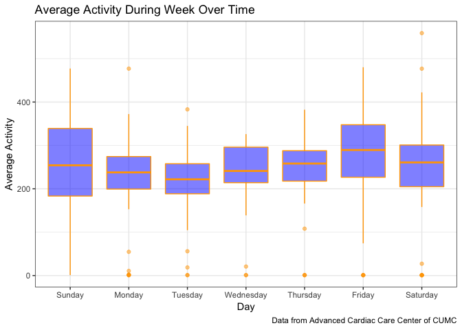
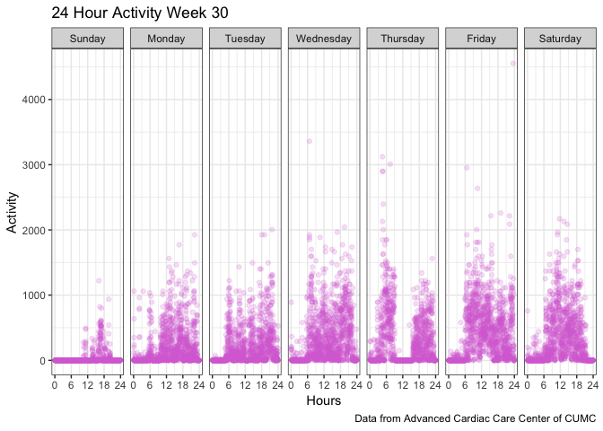

Midterm Project
================
Justin Hsie

#### Setup

``` r
library(tidyverse)
library(knitr)
library(patchwork)
library(viridis)
library(wordcountaddin)
```

### Data Cleaning

``` r
accel_data = read_csv(file = "data/p8105_mtp_data.csv") %>% 
  janitor::clean_names() %>% 
  mutate(day = as.factor(day)) %>% 
  mutate(day = 
           factor(day, levels = 
                    c("Sunday", "Monday", "Tuesday", 
                      "Wednesday", "Thursday",
                      "Friday", "Saturday"), 
                  ordered = TRUE)) %>% 
  arrange(day) %>% 
  arrange(week) %>% 
  mutate(total_act = rowSums(.[,3:1440], na.rm = TRUE)) %>% 
  mutate(avg_act = rowMeans(.[,3:1440], na.rm = TRUE))
```

This dataset consists of week, day, and activity variables. Each activity column represents a summary of the voltage signal in a minute of the day. There are 329 rows and 1,442 variables total.

### Total Activity Over Time

``` r
year_plot = 
  ggplot(accel_data, aes(x = week, y = total_act, color = week)) +
  geom_point(alpha = .5) +
  geom_smooth() +
  labs(
    title = "Total Activity Plot",
    x = "Week",
    y = "Total Activity",
    caption = "Data from Advanced Cardiac Care Center of CUMC"
  ) +
  viridis::scale_color_viridis(
    name = "Week"
  ) + 
  theme_bw() + 
  theme(legend.position = "bottom")
year_plot
```


### Average Activity During Week Over Time

``` r
week_plot = 
  ggplot(accel_data, aes(x = day, y = avg_act)) + 
  geom_boxplot(color = "orange", fill = "blue", alpha = .5) +
  labs(
    title = "Average Activity During Week",
    x = "Day",
    y = "Average Activity",
    caption = "Data from Advanced Cardiac Care Center of CUMC"
  ) +
  theme_bw()
week_plot
```



### 24 Hour Activity During Week 30

``` r
week_hour_act = accel_data %>% 
  gather(key = daily_act, value = activity, activity_1:activity_1440) %>%
  filter(week == 30) %>% 
  mutate(daily_act = str_replace(daily_act, "activity_", "")) %>% 
  mutate(daily_act = as.numeric(daily_act) / 60)

week_hour_plot = 
  ggplot(week_hour_act, aes(x = daily_act, y = activity)) +
  geom_point(color = "orchid", alpha = .2) +
  scale_x_continuous(breaks = seq(0, 24, by = 6)) +
  facet_grid(. ~ day) +
  geom_smooth() +
  labs(
    title = "24 Hour Activity During Week 30",
    x = "Hours",
    y = "Activity",
    caption = "Data from Advanced Cardiac Care Center of CUMC"
  ) +
  theme_bw() 
week_hour_plot
```



### Example 24 Hour Activity on Wednesday, Week 30

``` r
sunday_act = accel_data %>% 
  gather(key = daily_act, value = activity, activity_1:activity_1440) %>%
  filter(day == "Wednesday", week == 30) %>% 
  mutate(daily_act = str_replace(daily_act, "activity_", "")) %>% 
  mutate(daily_act = as.numeric(daily_act) / 60)

sunday_plot = ggplot(sunday_act, aes(x = daily_act, y = activity)) +
  geom_point(color = "gold", alpha = .6) +
  scale_x_continuous(breaks = seq(0, 24, by = 2)) +
  geom_smooth() +
  labs(
    title = "24 Hour Activity Wednesday, Week 30",
    x = "Hours",
    y = "Activity",
    caption = "Data from Advanced Cardiac Care Center of CUMC"
  ) +
  theme_bw() 
sunday_plot
```


``` r
wordcountaddin::text_stats("p8105_mtp_jih2119.Rmd")
```

| Method          | koRpus      | stringi       |
|:----------------|:------------|:--------------|
| Word count      | 61          | 54            |
| Character count | 364         | 363           |
| Sentence count  | 3           | Not available |
| Reading time    | 0.3 minutes | 0.3 minutes   |
